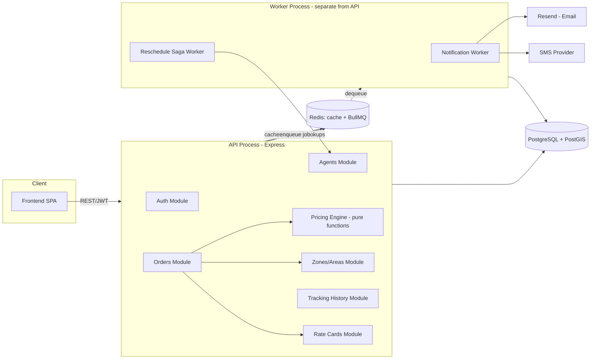
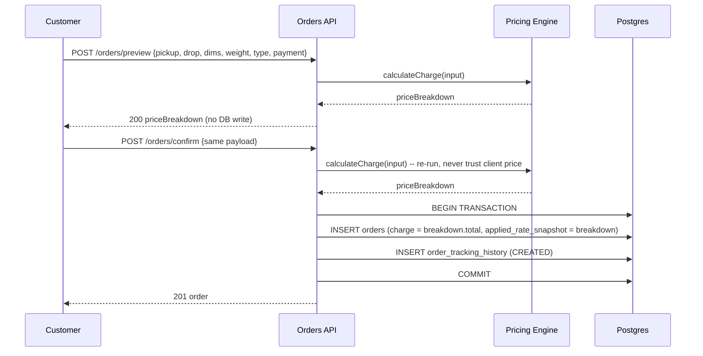
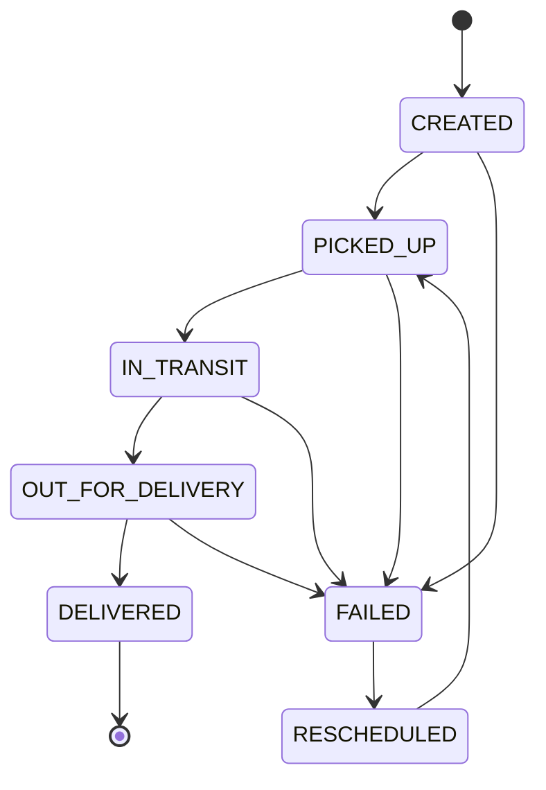
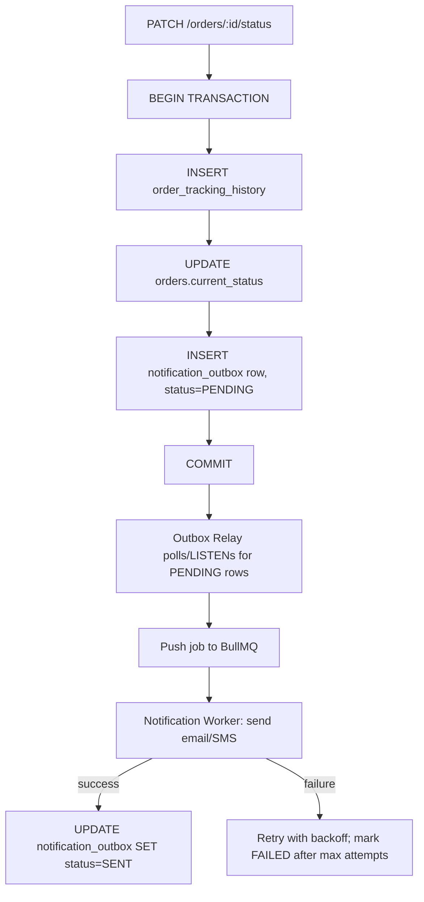
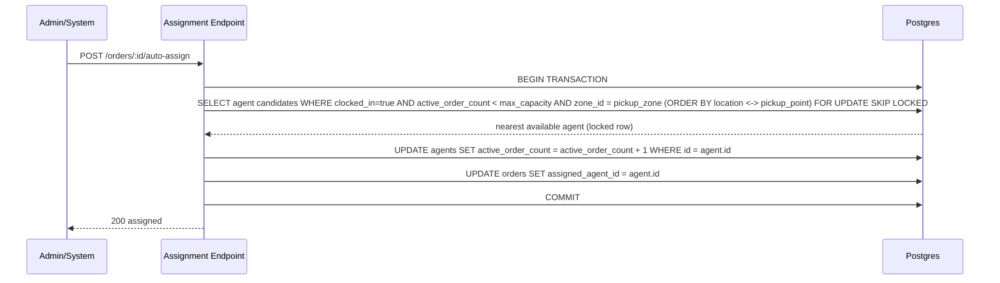
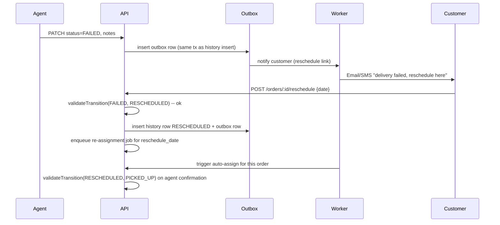

# designDoc.md — System Design

This document is the engineering blueprint: schema, API surface, the core algorithms, and the four flows that are hardest to get right (pricing, status lifecycle, auto-assignment under concurrency, failed-delivery saga).

---

## 1. High-Level Architecture



**Why the worker is a separate process, not just an async function**: the API process can be redeployed/restarted independently of the worker, and a worker crash never takes down order intake. This is the direct fix for the most common failure mode in this kind of project — notification latency or failure blocking the request path.

---

## 2. Database Schema

```sql
-- Users (single table, role column; simplest correct model for 3 roles)
CREATE TABLE users (
  id            UUID PRIMARY KEY DEFAULT gen_random_uuid(),
  name          TEXT NOT NULL,
  email         TEXT UNIQUE NOT NULL,
  phone         TEXT,
  password_hash TEXT NOT NULL,
  role          TEXT NOT NULL CHECK (role IN ('customer','agent','admin')),
  created_at    TIMESTAMPTZ DEFAULT now()
);

-- Zones
CREATE TABLE zones (
  id    UUID PRIMARY KEY DEFAULT gen_random_uuid(),
  name  TEXT NOT NULL UNIQUE
);

-- Pincode -> Zone mapping
CREATE TABLE areas (
  pincode TEXT PRIMARY KEY,
  zone_id UUID NOT NULL REFERENCES zones(id)
);

-- Rate cards: one row per (from_zone, to_zone, order_type)
CREATE TABLE rate_cards (
  id            UUID PRIMARY KEY DEFAULT gen_random_uuid(),
  from_zone_id  UUID NOT NULL REFERENCES zones(id),
  to_zone_id    UUID NOT NULL REFERENCES zones(id),
  order_type    TEXT NOT NULL CHECK (order_type IN ('B2B','B2C')),
  rate_per_kg   NUMERIC(10,2) NOT NULL,
  is_active     BOOLEAN DEFAULT true,   -- soft delete only, never hard-delete
  created_at    TIMESTAMPTZ DEFAULT now(),
  updated_at    TIMESTAMPTZ DEFAULT now(),
  UNIQUE (from_zone_id, to_zone_id, order_type)
);

-- COD surcharge config, per order type
CREATE TABLE cod_surcharge_config (
  id          UUID PRIMARY KEY DEFAULT gen_random_uuid(),
  order_type  TEXT NOT NULL UNIQUE CHECK (order_type IN ('B2B','B2C')),
  type        TEXT NOT NULL CHECK (type IN ('FLAT','PERCENTAGE')),
  value       NUMERIC(10,2) NOT NULL,
  is_active   BOOLEAN DEFAULT true
);

-- Agents
CREATE TABLE agents (
  id                  UUID PRIMARY KEY DEFAULT gen_random_uuid(),
  user_id             UUID NOT NULL REFERENCES users(id),
  zone_id             UUID REFERENCES zones(id),
  current_location    GEOGRAPHY(POINT, 4326),  -- PostGIS
  clocked_in          BOOLEAN DEFAULT false,
  active_order_count  INT DEFAULT 0,
  max_capacity        INT DEFAULT 5,
  updated_at          TIMESTAMPTZ DEFAULT now()
);

-- Orders
CREATE TABLE orders (
  id                    UUID PRIMARY KEY DEFAULT gen_random_uuid(),
  customer_id           UUID NOT NULL REFERENCES users(id),
  created_by            UUID NOT NULL REFERENCES users(id), -- admin or customer
  pickup_address        TEXT NOT NULL,
  pickup_pincode        TEXT NOT NULL,
  pickup_zone_id        UUID NOT NULL REFERENCES zones(id),
  drop_address          TEXT NOT NULL,
  drop_pincode          TEXT NOT NULL,
  drop_zone_id          UUID NOT NULL REFERENCES zones(id),
  length_cm             NUMERIC(8,2) NOT NULL,
  breadth_cm            NUMERIC(8,2) NOT NULL,
  height_cm             NUMERIC(8,2) NOT NULL,
  actual_weight_kg      NUMERIC(8,2) NOT NULL,
  billable_weight_kg    NUMERIC(8,2) NOT NULL,
  order_type            TEXT NOT NULL CHECK (order_type IN ('B2B','B2C')),
  payment_type          TEXT NOT NULL CHECK (payment_type IN ('PREPAID','COD')),
  rate_card_id          UUID REFERENCES rate_cards(id),
  applied_rate_snapshot JSONB NOT NULL,   -- frozen rate + surcharge values at order time
  cod_surcharge         NUMERIC(10,2) DEFAULT 0,
  charge                NUMERIC(10,2) NOT NULL,
  current_status        TEXT NOT NULL DEFAULT 'CREATED',  -- cached pointer, NOT source of truth
  assigned_agent_id     UUID REFERENCES agents(id),
  reschedule_date       DATE,
  created_at            TIMESTAMPTZ DEFAULT now(),
  updated_at            TIMESTAMPTZ DEFAULT now()
);

-- Immutable, append-only status ledger
CREATE TABLE order_tracking_history (
  id          UUID PRIMARY KEY DEFAULT gen_random_uuid(),
  order_id    UUID NOT NULL REFERENCES orders(id),
  from_status TEXT,
  to_status   TEXT NOT NULL,
  actor_id    UUID NOT NULL REFERENCES users(id),
  actor_role  TEXT NOT NULL,
  notes       TEXT,
  created_at  TIMESTAMPTZ DEFAULT now()
);
-- No UPDATE statement on this table exists anywhere in the codebase, by design.

-- Outbox table — see §6
CREATE TABLE notification_outbox (
  id          UUID PRIMARY KEY DEFAULT gen_random_uuid(),
  order_id    UUID NOT NULL REFERENCES orders(id),
  channel     TEXT NOT NULL CHECK (channel IN ('EMAIL','SMS')),
  payload     JSONB NOT NULL,
  status      TEXT NOT NULL DEFAULT 'PENDING' CHECK (status IN ('PENDING','SENT','FAILED')),
  attempts    INT DEFAULT 0,
  created_at  TIMESTAMPTZ DEFAULT now()
);
```

**Indexes worth calling out:** `orders(current_status, pickup_zone_id)` for admin filtering, `agents USING GIST(current_location)` for nearest-neighbor queries, `order_tracking_history(order_id, created_at)` for timeline assembly.

---

## 3. The Rate Calculation Engine

Pure, side-effect-free, identical call site from preview and confirm:

```ts
function billableWeight(l: number, b: number, h: number, actual: number): number {
  const volumetric = (l * b * h) / 5000;
  return Math.max(actual, volumetric);
}

async function calculateCharge(input: {
  pickupPincode: string;
  dropPincode: string;
  orderType: 'B2B' | 'B2C';
  paymentType: 'PREPAID' | 'COD';
  weight: number; // already billable
}): Promise<PriceBreakdown> {
  const fromZone = await resolveZone(input.pickupPincode);   // cached
  const toZone   = await resolveZone(input.dropPincode);     // cached
  const rateCard = await getRateCard(fromZone, toZone, input.orderType); // cached
  const base = rateCard.rate_per_kg * input.weight;
  const codSurcharge = input.paymentType === 'COD'
    ? await applyCodSurcharge(base, input.orderType)
    : 0;
  return {
    fromZone, toZone, rateCardId: rateCard.id,
    ratePerKg: rateCard.rate_per_kg, billableWeight: input.weight,
    base, codSurcharge, total: base + codSurcharge,
  };
}
```

Zero constants. Every number used comes from a DB row resolved through `resolveZone`/`getRateCard`, both Redis-cached and invalidated on admin writes to `areas`/`rate_cards`/`cod_surcharge_config`.

---

## 4. Two-Phase Checkout (Quote → Confirm)



**Why no reservation/lock during preview**: rate cards change rarely enough that holding a lock for the gap between preview and confirm isn't worth the complexity. The correctness guarantee instead comes from re-running the identical pure function at confirm time — if the admin changed a rate card in that window, the customer simply gets the new correct price at confirm, and the response clearly reflects the actual charge (no silent mismatch is possible because there is no cached price being reused).

---

## 5. Order Status Lifecycle



All transitions go through one function:

```ts
const ALLOWED: Record<Status, Status[]> = {
  CREATED: ['PICKED_UP', 'FAILED'],
  PICKED_UP: ['IN_TRANSIT', 'FAILED'],
  IN_TRANSIT: ['OUT_FOR_DELIVERY', 'FAILED'],
  OUT_FOR_DELIVERY: ['DELIVERED', 'FAILED'],
  FAILED: ['RESCHEDULED'],
  RESCHEDULED: ['PICKED_UP'],
  DELIVERED: [],
};

function validateTransition(from: Status, to: Status): boolean {
  return ALLOWED[from]?.includes(to) ?? false;
}
```

`PATCH /orders/:id/status` calls `validateTransition`; on failure returns `409 Conflict` and writes nothing. On success, inside one DB transaction: insert a new `order_tracking_history` row, update `orders.current_status` (the cached pointer only), enqueue a notification job. The `orders.current_status` column is never the thing application logic trusts for "what happened" — only for fast filtering (`WHERE current_status = 'IN_TRANSIT'`).

---

## 6. Notifications — Outbox Pattern (fixing the dual-write problem)

Naively, "update status" + "send email" as two separate steps risks a dual-write failure: the status commits but the app crashes before the email job is enqueued, or vice versa. The fix is the **transactional outbox**:



The outbox row is written in the **same transaction** as the status change, so it's impossible for a status to change without a notification eventually being attempted, and impossible for a notification to fire for a status change that didn't actually commit. The relay (a lightweight poller or `LISTEN/NOTIFY` on Postgres) is the only thing that talks to BullMQ — the request path itself only ever does one local DB transaction.

---

## 7. Auto-Assignment Under Concurrency



`FOR UPDATE SKIP LOCKED` is the key detail: if two assignment requests race, the second one's query simply skips the row the first one is mid-transaction on and falls through to the next-nearest candidate, instead of blocking or — worse — both reading `active_order_count` before either writes it back (the classic lost-update race). This is what guarantees FR-18 (no agent ever exceeds `max_capacity`) under load, and is exactly the kind of guard a naive `SELECT` then `UPDATE` in two separate queries would not provide.

---

## 8. Failed Delivery Saga



Each step is independently retryable because each step is its own queued job with its own outbox-backed trigger — a failure sending the "reschedule" SMS doesn't block the reschedule date from being recorded, and a failure to find an available agent on the rescheduled date doesn't lose the order; it stays in `RESCHEDULED` and can be retried or manually assigned by admin.

---

## 9. API Surface (summary)

```
POST   /auth/register
POST   /auth/login

GET    /zones                 (admin)
POST   /zones                 (admin)
POST   /areas                 (admin)        -- map pincode -> zone
GET    /rate-cards             (admin)
POST   /rate-cards             (admin)
PUT    /rate-cards/:id         (admin)        -- soft-update; old snapshot still valid on past orders
POST   /cod-surcharge          (admin)

POST   /orders/preview         (customer, admin)
POST   /orders/confirm         (customer, admin)
GET    /orders                 (admin: all + filters; customer: own; agent: assigned)
GET    /orders/:id
GET    /orders/:id/timeline
PATCH  /orders/:id/status      (agent, admin)
POST   /orders/:id/reschedule  (customer)
POST   /orders/:id/auto-assign (admin, or system-triggered)
PATCH  /orders/:id/assign      (admin)        -- manual assignment

GET    /agents                 (admin)
PATCH  /agents/:id/clock-in
PATCH  /agents/:id/clock-out
PATCH  /agents/:id/location    (agent app pings current lat/lng)
```

---

## 10. Deliberate Simplifications (called out, not hidden)

- "Nearest agent" uses the agent's last-pinged lat/lng against the pickup address's geocoded point, falling back to same-zone matching if no recent location ping exists. True live GPS trail is out of scope.
- Rate cards have no time-of-day/seasonal variation — one active rate per (zone pair, order type) at any time.
- SMS delivery depends on whichever free-tier provider is configured at deploy time; documented in README as an explicit constraint, not a hidden gap.